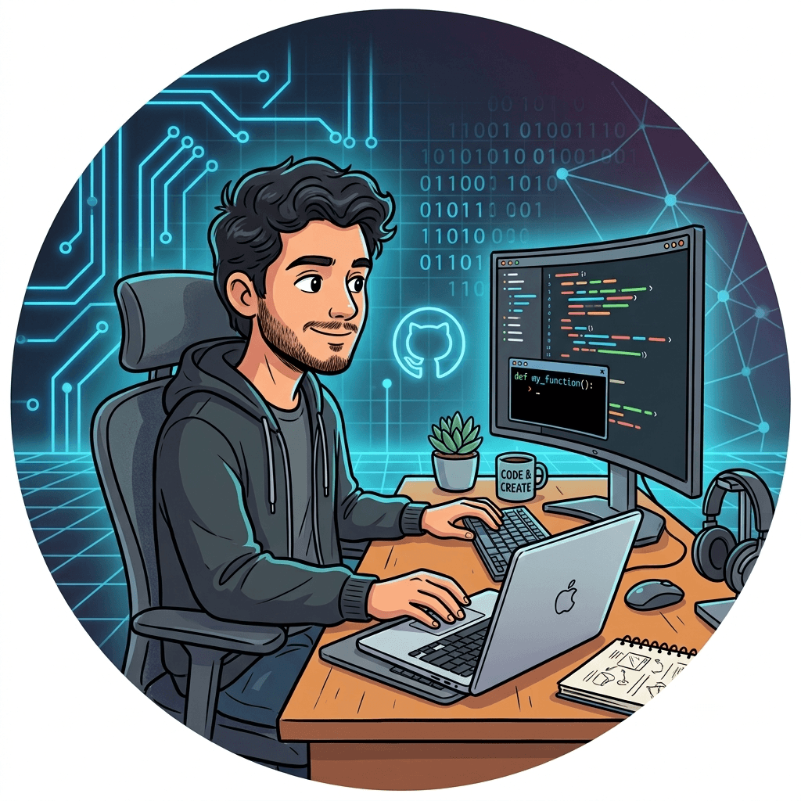

  

  

---

  

---

## 👨‍💻 About Me

🎓 Final Year B.Tech Computer Science student from India.

💻 Passionate about Full Stack Development using **Java, Spring Boot, React, and SQL**.

🤖 Exploring **Artificial Intelligence, Machine Learning, NLP, and OCR** to build smarter applications.

📚 Published research on **AI-powered Digital Governance** in the *International Journal of Computer Techniques (IJCT)*.

🚀 I enjoy building real-world software that solves practical problems through clean architecture and modern technologies.

---

## 🛠️ Tech Stack

Also:- LLMs, RAG, NLP, Prompt Engineering, and AI workflows.

---

Currently focused on backend development, AI integrations, and writing clean, scalable code.

- 💻 I enjoy building practical applications.
- 🤖 Exploring AI and automation.
- 🌱 Always learning something new.
- 🚀 Open to exciting opportunities.
